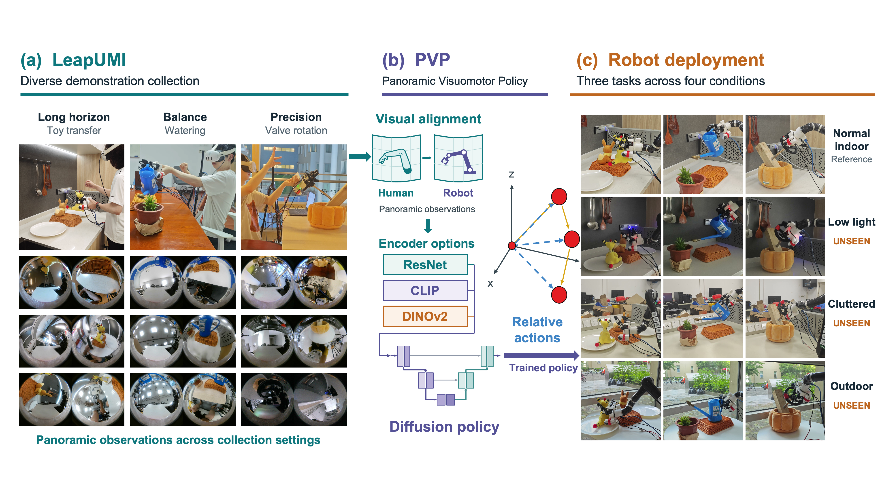
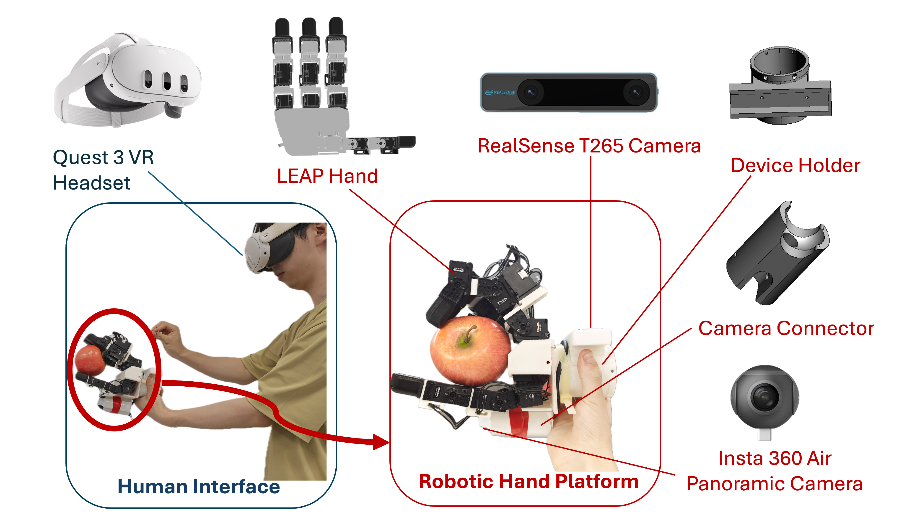

<h1 align="center" style="font-size: 3em;">LeapUMI: Learning Dexterous Robot Manipulation Policies without a Robot Arm</h1>

[[Project page]](https://leapumi.github.io)
[Paper]
[[Deployment guide]](https://github.com/leapumi/LeapUMI/blob/main/leapumi.md)

# Method



## 🛠️ Hardware Platform


## 🚀 Deployment Guide

This is a short end-to-end guide for collecting LeapUMI demonstrations, training a diffusion policy, and deploying it on a Kinova J2N6S300 arm with a LEAP Hand. For prerequisites, data-processing details, and troubleshooting, see the complete [deployment guide](leapumi.md).

### 1. Set up the workspace

```bash
export WS=/path/to/leapumi_workspace
mkdir -p "$WS"
git clone https://github.com/leapumi/LeapUMI.git "$WS/src"
cd "$WS"
conda env create -f src/teleop_env.yaml
conda env create -f src/umi_env.yaml

source /opt/ros/noetic/setup.bash
catkin_make
source "$WS/devel/setup.bash"
```

Install ROS Noetic, camera drivers, the Kinova driver, and device udev rules separately. Source both ROS setup files in every ROS terminal.

### 2. Collect and prepare demonstrations

With ROS, the Insta360 camera topic (`/insta360/image_raw`), the T265 pose topic (`/camera/odom/sample`), a Quest/Oculus headset, and the LEAP Hand ready, start the following in separate terminals:

```bash
# Terminal A: ROS master
conda activate bidex_manus_teleop
source /opt/ros/noetic/setup.bash
source "$WS/devel/setup.bash"
roscore
```

```bash
# Terminal B: Insta360
source /opt/ros/noetic/setup.bash
source "$WS/devel/setup.bash"
roslaunch jsk_perception sample_insta360_air.launch
```

```bash
# Terminal C: T265
source /opt/ros/noetic/setup.bash
source "$WS/devel/setup.bash"
roslaunch realsense2_camera rs_t265.launch
```

Ensure the LEAP Hand udev rules are installed. If its serial port needs temporary access permissions, run:

```bash
sudo chmod 777 /dev/ttyUSB*
```

Then run the control and recording scripts in separate terminals:

```bash
conda activate bidex_manus_teleop
source /opt/ros/noetic/setup.bash
source "$WS/devel/setup.bash"
python "$WS/src/telekinesis/leapumi_system_control.py"
python "$WS/src/telekinesis/leapumi_dataset_recording.py"
```

In the recorder, use `r` to start an episode, `s` to save a successful episode, `p` to discard it, and `q` to quit. Inspect each recording with the viewer to determine its valid frame range:

```bash
conda activate umi
cd "$WS/src/data_process"
python hdf5_image_view.py /absolute/path/leap_action_0.hdf5
```

Write each range as `demo_id start_frame end_frame` in `crop_ranges.txt` (configured by `crop_range_txt`); the end frame is included. Set `input_dir` and `output_file` in `data_transfer_crop.py`, then crop and convert the dataset:

```bash
conda activate umi
cd "$WS/src/data_process"
python data_transfer_crop.py
python convert_hdf5_to_zarr.py \
  /absolute/path/training_dataset.hdf5 \
  /absolute/path/training_dataset.zarr.zip \
  --split
```

For the default `leapumi_split` task, use `--split` to write the two `224x224` image keys `camera0_rgb_left` and `camera0_rgb_right`. Without this flag, the converter writes the full `224x448` image as `camera0_rgb`.

### 3. Train a policy

```bash
conda activate umi
cd "$WS/src/universal_manipulation_interface"
CUDA_VISIBLE_DEVICES=0 python train.py \
  --config-name=train_diffusion_unet_timm_leapumi_workspace \
  task.dataset_path=/absolute/path/to/leapumi_dataset.zarr.zip \
  logging.mode=offline \
  hydra.run.dir="$WS/data/outputs/leapumi_$(date +%Y%m%d_%H%M%S)"
```

The checkpoint is saved as `checkpoints/latest.ckpt`. Use a checkpoint trained with `leapumi_split`: deployment expects the two split-image keys and a 25-dimensional action (3 position + 6 rotation + 16 LEAP Hand).

### 4. Deploy on the robot

Before running, ensure an NVIDIA GPU and desktop session are available, the Kinova arm and LEAP Hand are connected. Start the following in separate terminals:

```bash
# Terminal A: ROS master
conda activate umi
source /opt/ros/noetic/setup.bash
source "$WS/devel/setup.bash"
roscore
```

```bash
# Terminal B: Kinova J2N6S300 driver
source /opt/ros/noetic/setup.bash
source "$WS/devel/setup.bash"
roslaunch kinova_bringup kinova_robot.launch kinova_robotType:=j2n6s300
```

```bash
# Terminal C: Insta360 camera
source /opt/ros/noetic/setup.bash
source "$WS/devel/setup.bash"
roslaunch jsk_perception sample_insta360_air.launch
```

```bash
# Give the LEAP Hand serial port temporary access if needed
sudo chmod 777 /dev/ttyUSB*
```

Then verify initialization without policy actions:

```bash
# Terminal D: deployment
conda activate umi
source /opt/ros/noetic/setup.bash
source "$WS/devel/setup.bash"
cd "$WS/src/universal_manipulation_interface/deployment"
python real.py \
  --checkpoint /absolute/path/to/checkpoints/latest.ckpt \
  --device cuda:0 \
  --max-steps 0
```

After checking the camera, ROS topics, URDF, and PyBullet GUI, run the policy:

```bash
python real.py \
  --checkpoint /absolute/path/to/checkpoints/latest.ckpt \
  --device cuda:0 \
  --steps-per-inference 8
```

`--max-steps 0` is only an action-free check: it still connects to the hardware, enables LEAP Hand torque, and opens PyBullet. Press `Ctrl+C` to stop deployment.
