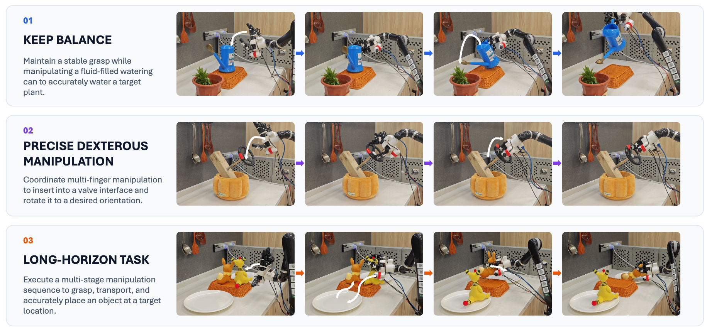
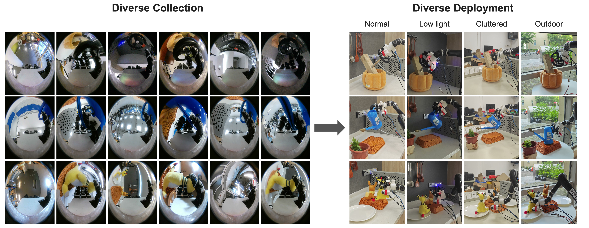

<h1 align="center" style="font-size: 3em;">LeapUMI: Learning Dexterous Robot Manipulation Policies without a Robot Arm</h1>

[[Project page]](https://dex-umi.github.io)
[Paper]
[[Deployment guide]](https://github.com/leapumi/LeapUMI/blob/main/leapumi.md)

## Hardware Platform

## Experiments
#### Real-world manipulation tasks

#### Diverse-scene experiments

Representative panoramic observations collected --> Robot  trained executions.

## Deployment Guide
Refer to [leapumi.md](https://github.com/leapumi/LeapUMI/blob/main/leapumi.md)